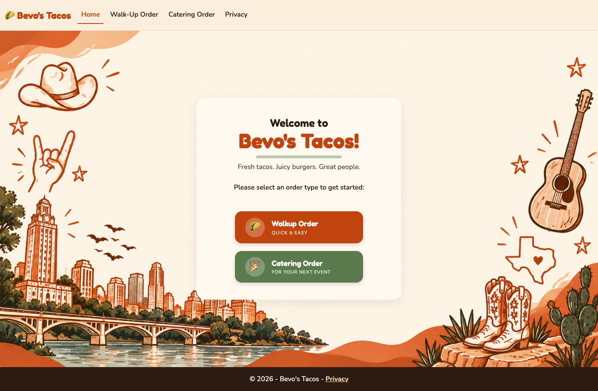
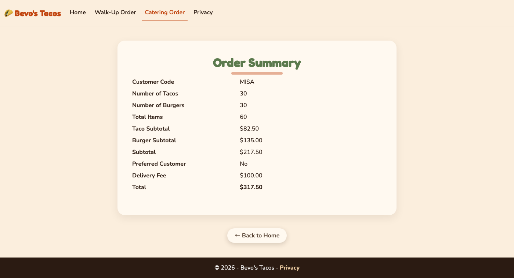
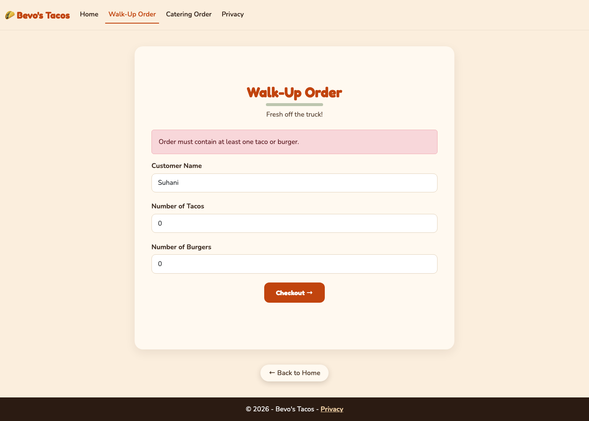

# Bevo's Tacos Checkout

[](https://github.com/suhxnitiwari/Bevo_Taco-Checkout/actions/workflows/ci.yml)


A checkout app for an Austin food truck, built with ASP.NET Core MVC. It prices walk-up and catering orders with different rules: sales tax for walk-up customers, and delivery fees with free-delivery rules for catering customers.

Built for MIS 333K Homework 2 (Object-Oriented Programming and Inheritance) at UT Austin.



| Catering order summary | Validation error |
| --- | --- |
|  |  |

## Features

- **Walk-up orders:** tacos ($2.75) and burgers ($4.50), plus 8.25% sales tax rounded to the cent.
- **Catering orders:** a 2–4 letter customer code and a delivery fee from $0 to $250. Delivery is free for preferred customers and for orders of $1,000 or more.
- **Validation in two places:** data annotations on the models drive both the browser checks (jQuery Unobtrusive Validation) and the server checks (`ModelState`), so the rules live in one spot.
- **Business rules in the domain model:** an order with no items throws an `EmptyOrderException`, which the controller turns into a form error.
- **Unit tests:** xUnit tests cover pricing, tax rounding, the $1,000 free-delivery threshold, and every validation rule. They run on each push through GitHub Actions.

## Design

```
Order (abstract)                    TacoPrice, BurgerPrice, item counts, subtotals, Total
│  CalcTotals()                     computes subtotals (throws EmptyOrderException if
│                                   the order is empty), then calls CalcTotal()
│  abstract CalcTotal()             each order type adds its own charges
│
├── WalkupOrder                     CustomerName, SalesTax
│     CalcTotal() → subtotal + 8.25% tax
│
└── CateringOrder                   CustomerCode, DeliveryFee, PreferredCustomer
      CalcTotal() → subtotal + delivery fee (waived when preferred or ≥ $1,000)
```

`CalcTotals()` in the base class runs the steps every order shares and leaves one step for each subclass to fill in (the template method pattern). Calculated amounts have private setters, so only the pricing logic can change them. The models hold all pricing and validation logic and never reference views.

The controller stays thin. Both checkout actions go through one `Checkout(Order, formView)` helper that checks `ModelState`, calls `CalcTotals()`, and picks the view. The form posts are protected against cross-site request forgery with anti-forgery tokens.

## Project layout

```
src/BevosTacos/
  Controllers/HomeController.cs   checkout forms and totals actions
  Models/                         Order, WalkupOrder, CateringOrder, EmptyOrderException
  Views/Home/                     home, checkout, and summary pages
  wwwroot/                        styles, images, client libraries
tests/BevosTacos.Tests/           xUnit tests for the models
```

## Running locally

Requires the [.NET 10 SDK](https://dotnet.microsoft.com/download).

```bash
dotnet run --project src/BevosTacos   # start the app
dotnet test                          # run the unit tests
```

## Author

**Suhani Tiwari**, University of Texas at Austin
